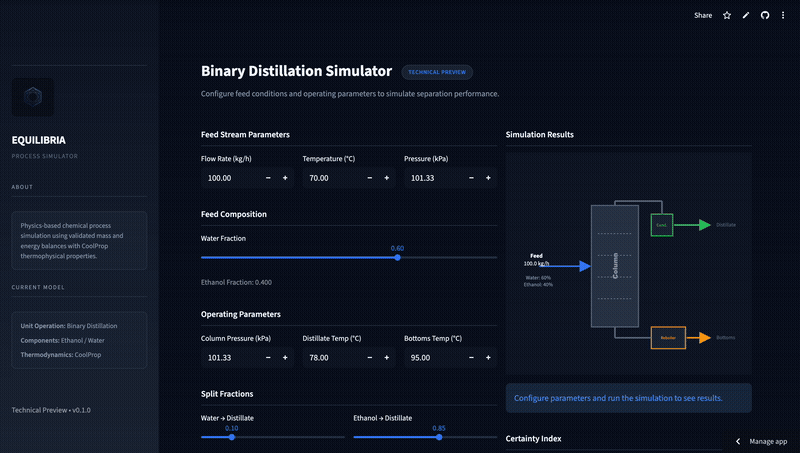

# Equilibria: Distillation Simulation Platform

Equilibria is a modular chemical engineering simulation platform for modeling separation processes with progressive realism — a design approach that allows systems to evolve from simplified academic assumptions to industry-grade physical accuracy.

This MVP implements a binary distillation column with a structured backend, validated unit operations, and an interactive frontend for exploring system behavior.

**Tech Stack:** Python · FastAPI · Streamlit · pytest · CoolProp


---
## System Overview

Equilibria is built as a composable simulation system — unit operations encapsulate 
physical behavior independently and can be assembled into flowsheets without tight 
coupling between layers. The backend handles simulation execution and exposes endpoints 
via FastAPI, while the core layer defines the unit operations themselves (`DistillationColumn`, 
`HeatExchanger`, etc.) with embedded mass and energy balances. A separate simulation layer 
orchestrates flowsheet logic and stream propagation, keeping unit op logic reusable across 
different process configurations. The Streamlit frontend sits on top as a lightweight 
interface for exploring system behavior.

### Architecture Layers

- **Backend (FastAPI)** — Handles simulation execution and exposes endpoints for flowsheet interaction
- **Core Layer (`backend/core/`)** — Defines unit operations (e.g., `DistillationColumn`, `HeatExchanger`) with embedded mass and energy balances
- **Simulation Layer (`backend/simulation/`)** — Orchestrates flowsheet logic, stream propagation, and system-level validation
- **Frontend (Streamlit)** — Provides a lightweight interface for interacting with the simulation

### Design Priorities

- **Modularity** — unit operations can be extended or replaced independently
- **Testability** — each unit operation is validated with pytest
- **Transparency** — explicit balance checks with defined tolerances
- **Extensibility** — architecture supports future non-ideal and ML-driven models

---

## Design Decisions

FastAPI was chosen over Flask for its native Pydantic type validation and support for 
async scaling as the platform grows. Streamlit handles the MVP frontend — it was the 
fastest path to an interactive UI, with a React replacement planned for production. 

On the simulation side, balance validation uses tolerance-based checks rather than strict 
equality because floating-point arithmetic makes exact comparison unreliable at industry
precision. CoolProp drives thermophysical property evaluation, which is what enables the 
platform's core promise: a clean path from ideal to real-fluid behavior without rearchitecting 
the system.

---

## Quick Start

### 1. Clone the repository
```bash
git clone git@github.com:alejandratena/distillation_sim_v1.git
cd distillation_sim_v1
```

### 2. Create and activate a virtual environment

**Mac/Linux:**
```bash
python3 -m venv .venv
source .venv/bin/activate
```

**Windows:**
```bash
python -m venv .venv
.venv\Scripts\activate
```

### 3. Install dependencies
```bash
pip install -r requirements.txt
```

---

## Running the Application

> ⚠️ Activate your virtual environment in both terminals before starting.

**Terminal 1 — Backend (FastAPI):**
```bash
uvicorn main:app --reload
```
Runs at: http://localhost:8000

**Terminal 2 — Frontend (Streamlit):**
```bash
streamlit run app.py
```
Runs at: http://localhost:8501

---

## Running Tests
```bash
pytest backend/tests/
```

The test suite validates:
- Mass balance consistency across unit operations
- Energy balance behavior under defined tolerances
- System-level integration between connected units

---

## Project Structure
```
distillation_sim_v1/
├── backend/
│   ├── core/          # Unit operations and base classes
│   ├── simulation/    # Flowsheet orchestration logic
│   └── tests/         # Pytest validation suite
├── main.py            # FastAPI entry point
├── app.py             # Streamlit frontend
├── requirements.txt
└── README.md
```

---

## Roadmap

- Non-ideal thermodynamics (γ–φ, EOS-based models)
- Recycle streams and convergence algorithms
- React-based frontend with interactive flowsheet builder
- Simulation persistence (database integration)
- ML-assisted parameter estimation and optimization
- "Progressive realism" UI controls for toggling model assumptions

---

## Contributing

- Use small, descriptive commits grouped by functionality
- Avoid committing system/IDE files (`.idea/`, `__pycache__/`, `.DS_Store`)
- Document new modules or major changes with inline comments or README updates

---

## Contact

Questions, ideas, or collaboration: [@alejandratena](https://github.com/alejandratena)